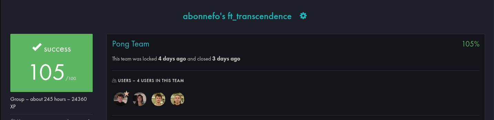

# MODULES

## Web
- [x] Major module: Use a Framework as backend.
- [x] Minor module: Use a front-end framework or toolkit.
- [x] Minor module: Use a database for the backend -and more.

## User Management
- [x] Major module: Standard user management, authentication, users across tournaments

## Gameplay and user experience
- [x] Minor module: Game Customization Options.

## AI-Algo
- [x] Major module: Introduce an AI Opponent
- [x] Minor module: User and Game Stats Dashboards.

## Cybersecurity
- [x] Major module: Implement Two-Factor Authentication (2FA) and JWT.

## Graphics
- [x] Major module: Implementing Advanced 3D Techniques

## Accessibility
- [x] Minor module: Expanding Browser Compatibility.
- [x] Minor module: Multiple language supports.

### Total 8/7 points




# **RUN THE PROJECT**

## **1. Certificates with mkcert**

### **Installation**
To handle certificates with `mkcert`, which are automatically created in `django/mysite/certifSSL` and `frontend/srcs`:

1. **Download mkcert**:
   ```bash
   wget --no-check-certificate https://dl.filippo.io/mkcert/latest\?for\=linux/amd64 -O ~/mkcert
   ```

2. **Set up and install**:
   ```bash
   mkdir -p ~/.bin
   mv ~/mkcert ~/.bin/
   chmod +x ~/.bin/mkcert
   echo 'export PATH=$HOME/.bin:$PATH' >> ~/.zshrc
   source ~/.zshrc
   ```

3. **Create certificates**:
   ```bash
   mkcert -CAROOT
   mkcert -install
   ```

4. **Add the certificate**:  
   Add the generated certificate to your browser's **Authorities** in the security settings.

---

## **2. Configure the `.env`**

Create a `.env` file at the project root and fill in the following information:

```env
SECRET_KEY=your_django_secret_key
DEBUG="True"

POSTGRES_HOST=your_postgres_host
POSTGRES_DB=your_postgres_db
POSTGRES_USER=your_postgres_user
POSTGRES_PASSWORD=your_postgres_password

EMAIL_HOST=your_email_host
EMAIL_HOST_PASSWORD=your_email_password
```

---

## **3. Run the Project**

### **Main Command**:
Run the following command to start the project:

```bash
make
```

### **Access the Applications**:
- **Frontend**: [https://127.0.0.1:8000/](https://127.0.0.1:8000/)
- **Backend**: [https://127.0.0.1:8001/](https://127.0.0.1:8001/)


# **PONG GAME**


